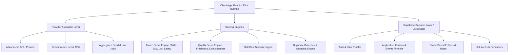

# Implementation Plan - Job Intelligence & Career Management Platform

Build a next-generation, production-grade **Job Intelligence and Career Management Platform** (**JobPulse / OrbitHire**) built with React, TypeScript, Tailwind CSS, Lucide icons, TanStack Query, and Supabase.

## User Review Required

> [!IMPORTANT]
> - **Supabase Integration**: We will provide a complete, plug-and-play SQL schema (`supabase/schema.sql`) with RLS policies, tables (`profiles`, `jobs`, `saved_jobs`, `applications`, `application_events`, `job_preferences`, `custom_folders`, `job_alerts`, `user_skills`), storage buckets, and triggers.
> - **Zero-Setup Demo & Production Hybrid Mode**: The app will automatically work with full offline/localStorage persistence + mock sync out of the box so it is 100% interactive and testable immediately, while cleanly connecting to live Supabase (via `.env.local` / `VITE_SUPABASE_URL` and `VITE_SUPABASE_ANON_KEY`) whenever provided!
> - **Real Job API Architecture**: Includes a clean `JobProvider` abstraction (`AdzunaProvider`, `GreenhouseProvider`, `LeverProvider`, `MockDataProvider`), real natural language filter parsing, duplicate job detection & clustering, and Edge-Function ready API proxy services.

---

## Architecture & Features Overview

---

## Proposed Project Structure & Files

### 1. Project Initialization & Foundation
- `package.json`, `vite.config.ts`, `tailwind.config.js`, `postcss.config.js`, `tsconfig.json`
- `index.html`, `src/main.tsx`, `src/index.css` (Curated design tokens, glassmorphism, accent themes: Indigo, Ocean, Forest, Sunset, Midnight, Dark/Light modes)

### 2. Types & Core Schemas (`src/types/`)
- `job.ts`: Normalized `Job`, `JobProvider`, `MatchScore`, `JobQualityScore`, `SkillGap`, `JobFilterState`, `DuplicateGroup`
- `application.ts`: `Application`, `ApplicationStatus` (`saved`, `applied`, `assessment`, `interview`, `offer`, `rejected`), `ApplicationEvent`, `FollowUpReminder`
- `profile.ts`: `UserProfile`, `UserSkill`, `JobPreference`, `CustomFolder`, `JobAlert`
- `supabase.ts`: Database types matching SQL schema

### 3. Services & Engines (`src/services/`)
- `scoring/matchScoreEngine.ts`: Weighted multidimensional match calculation (Skills, Exp, Loc, Salary, Remote, Title semantic match)
- `scoring/qualityScoreEngine.ts`: Completeness, salary transparency, freshness decay, company info, apply link clarity
- `scoring/skillGapEngine.ts`: User skills vs Job requirements classifier + actionable advice
- `nlp/searchParser.ts`: Natural language search query parser (extracts title, location, remote, salary, exp, e.g. *"Remote MERN jobs above ₹10 LPA"*)
- `dedup/duplicateDetector.ts`: Multi-signal similarity detector (title + company + location + normalized description)
- `jobProviders/`:
  - `types.ts` & `baseProvider.ts`
  - `adzunaProvider.ts`
  - `greenhouseProvider.ts`
  - `leverProvider.ts`
  - `sampleJobsData.ts` (Rich real-world dataset covering various tech & non-tech roles, Indian & Global hubs)
  - `jobAggregator.ts` (Unified search & multi-provider querying)

### 4. Supabase & Persistence Layer (`src/lib/` & `supabase/`)
- `supabase/schema.sql`: Full DDL script with RLS, triggers, indexes, and tables
- `src/lib/supabaseClient.ts`: Supabase client with graceful fallback to localStorage-backed mock client if unconfigured
- `src/lib/storage.ts`: Profile resume uploader & asset storage helper

### 5. State & Contexts / Hooks (`src/context/` & `src/hooks/`)
- `AuthContext.tsx`: Supabase Auth (Sign in, Sign up, Guest Demo login, Logout)
- `ThemeContext.tsx`: Dark/Light/System + 5 Accent themes (Default Indigo, Ocean Cyan, Forest Emerald, Sunset Rose, Midnight Amber)
- `useProfile.ts`: Load & update user profile, skills, and preferences
- `useJobs.ts`: Query, filter, score, and paginate jobs with TanStack Query
- `useApplications.ts`: Kanban status updates, timeline event loggers, interview dates, follow-up reminders
- `useSavedJobs.ts`: Folder assignment, bookmarking, and notes
- `useJobAlerts.ts`: Alert creation, triggers, and notification toast manager
- `useJobComparison.ts`: Multi-job (up to 3) comparison tray and score breakdown

### 6. Components & Feature Views (`src/components/` & `src/pages/`)
- **Navigation & Layout**:
  - `Navbar.tsx`, `Sidebar.tsx`, `MobileNav.tsx`, `ThemePicker.tsx`, `NotificationsPopover.tsx`
- **Home / Discovery (`pages/HomePage.tsx`)**:
  - Interactive Smart Search Hero with dynamic chips & quick filter builders
  - Live Job Intelligence KPI widget (Profile Match %, Strong Matches, Applications)
  - Featured Highlights & Trending Skill radar
- **Job Search (`pages/SearchPage.tsx`)**:
  - Natural Language search bar with auto-suggestions
  - Filter Drawer / Sticky Sidebar (Salary slider, Experience, Remote, Date posted, Source, Quality filter)
  - Job Card with Match badge, Quality badge, Freshness badge, Skill pills, Save button, Compare toggle
  - Duplicate group expander
- **Job Details Modal/Page (`components/jobs/JobDetailsModal.tsx`)**:
  - Match breakdown (Skills, Exp, Location, Salary, Preference)
  - Skill Gap Analysis (Have vs Missing pills + learning recommendation)
  - Job Quality breakdown ("Why this job scores high")
  - Direct vs External Apply action with transparency disclaimer
- **Personalized Feed (`pages/ForYouPage.tsx`)**:
  - "Best Matches", "Fresh Jobs", "High Salary", "Remote", "Closing Soon"
- **Application Tracker (`pages/ApplicationsPage.tsx`)**:
  - Kanban board (Drag & drop or quick move), List View, Application Detail Drawer, Timeline event logger, Follow-up reminder scheduler
- **Job Comparison (`pages/ComparePage.tsx` + Floating Tray)**:
  - Side-by-side comparison matrix for up to 3 jobs with "Best option for you" recommendation
- **Saved Jobs & Folders (`pages/SavedJobsPage.tsx`)**:
  - Smart folders (Dream Jobs, Apply Later, High Priority, Interview Prep, Custom folders)
- **Analytics (`pages/AnalyticsPage.tsx`)**:
  - Personal metrics: Applications sent, Interviews, Response rate %, Funnel bar chart, Missing skills frequency chart, Weekly velocity
- **Job Alerts (`pages/AlertsPage.tsx`)**:
  - Custom alert creator & notification history
- **Career Profile & Resume (`pages/ProfilePage.tsx`)**:
  - Resume upload simulator / Supabase Storage integration, Skill management tag input, Experience, Preferred locations, Salary expectations
- **Supabase Setup Guide & Config Modal**:
  - In-app helper showing how to connect real Supabase credentials and copy SQL schema easily.

---

## Verification Plan

### Automated & Build Verification
1. `npm install` all dependencies (`vite`, `react`, `react-dom`, `@tanstack/react-query`, `lucide-react`, `clsx`, `tailwind-merge`, `@supabase/supabase-js`, `canvas-confetti`, etc.).
2. `npm run build` to ensure 0 TypeScript compilation errors or build breakages.

### Manual & Interactive UI Verification
1. Test Smart Search & Natural Language filter parsing.
2. Test Match Score calculation dynamically changing when profile skills or experience are updated.
3. Test Job Quality Score and Skill Gap analysis on Job Details.
4. Test Drag & Drop / Status change in Kanban Application Tracker with timeline event addition.
5. Test Follow-up Reminders & Browser Notification trigger.
6. Test 3-Job Comparison matrix and smart recommendation badge.
7. Test Theme switcher (Dark/Light + 5 accent palettes).
8. Test Saved Jobs custom folders & job alerts.
